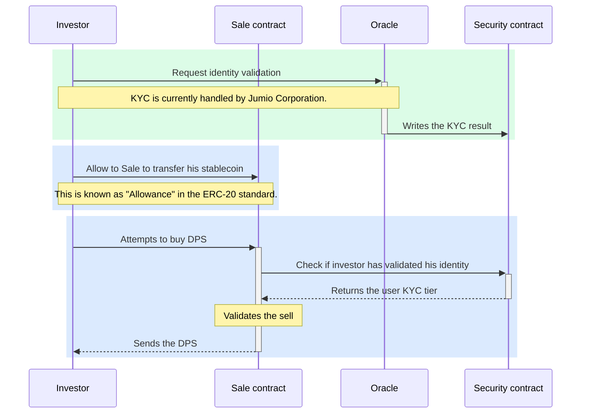

# DeepSquare blockchain

[](https://app.codecov.io/gh/deepsquare-io/blockchain)
[](https://github.com/deepsquare-io/Whitepaper/releases/latest/download/DeepSquare-WhitePaper.pdf)

## Sale process



# Overview

This project implements the contract of the Square token (DPS) on the Avalanche network.

The contract can be launched on several networks :

- Hardhat local network (also used for contract unit tests)
- Avalanche local network (see below)
- Avalanche Testnet (FUJI)
- Avalanche Mainnet

# Installation

```node
npm install
```

# Launch a contract on the avalanche local network

In order to use the avalanche local network, you need to follow [those instructions](https://docs.avax.network/build/tutorials/platform/create-a-local-test-network/)

You can then run

```node
npm run start:avalanche
```

# Useful commands

Deploy a script

```node
npx hardhat run scripts/deploy.js
```

Open the console, instead of writing scripts

```node
npx hardhat console
```

Verify a contract on snowtrace testnet

```node
npx hardhat verify --network fuji CONTRACT_ADDRESS
```

# Other commands from hardhat

Try running some of the following tasks:

```shell
npx hardhat accounts
npx hardhat compile
npx hardhat clean
npx hardhat test
npx hardhat node
npx hardhat help
REPORT_GAS=true npx hardhat test
npx hardhat coverage
npx hardhat run scripts/deploy.js
node scripts/deploy.js
npx eslint '**/*.js'
npx eslint '**/*.js' --fix
npx prettier '**/*.{json,sol,md}' --check
npx prettier '**/*.{json,sol,md}' --write
npx solhint 'contracts/**/*.sol'
npx solhint 'contracts/**/*.sol' --fix
```
